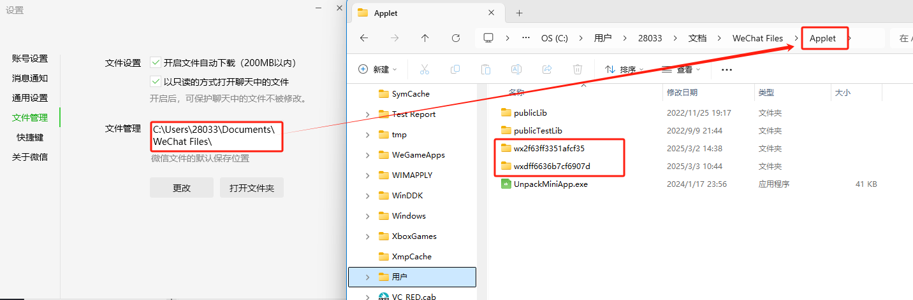
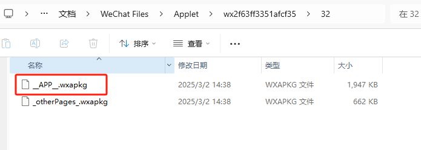
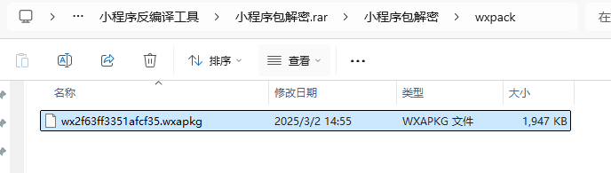
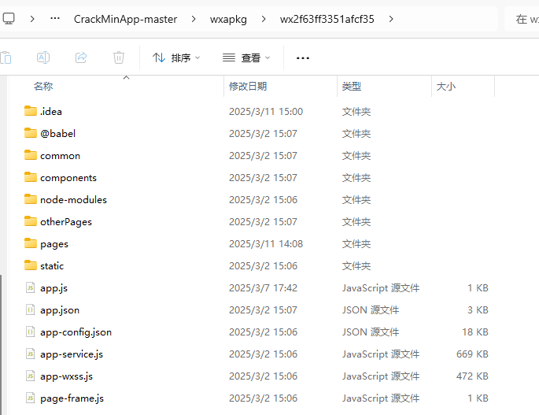
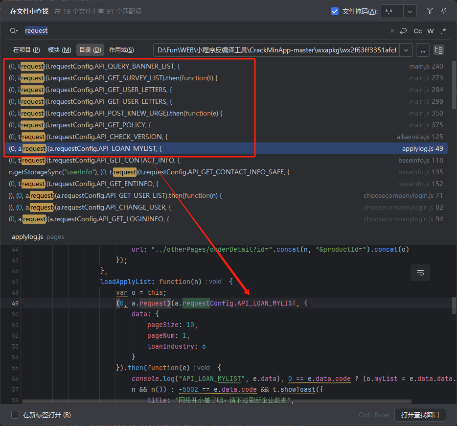
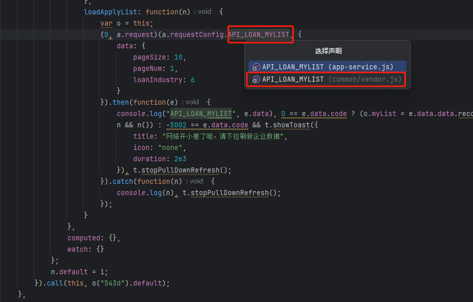
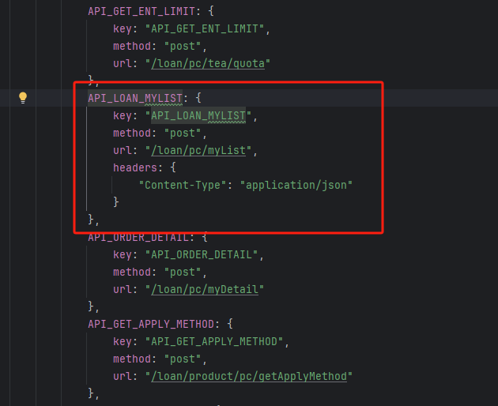

# 前言

最近做小程序测试时，发现虽然能找到url接口，但是构造请求时却不知道需要加上什么参数，所以找了个时间稍微研究了一下

# 小程序反编译

先记录一下反编译的过程，首先在wx找到小程序所在applet文件夹下，以wx前缀开头的就是，如果不确定哪个是目标程序，可以删除全部wx文件，在wx单独加载一次小程序即可

随便打开一个文件夹，其中的`__APP__.wxapkg`就是加密过的小程序

通过**UnpackMiniApp**工具解密可以得到如下的文件

再通过**CrackMinApp**解包小程序，最后就得到如下文件

# 接口查找

全局查找`request`关键字，可以看到以下结果

随便点击一个api可以看到接口的参数data

跟进该api就能看到接口详细信息

