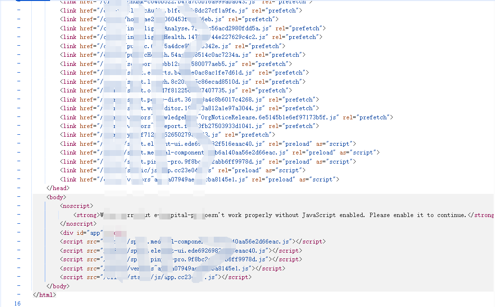

# webpack调试

首先将站点的所有js文件导出



在app.js处通过搜索export关键字，寻找加载器，找到之后可以在其后面添加上语句`window.myloader = a`，这样就可以全局调用加载器


加载器的作用是加载执行对应的函数，在app.js最底部加上`window.myloader("0091")`即可调用该函数


# 接口查找

通过正则`(/\w+)+`匹配查找接口url，可以看到定义了一些函数


去看看哪里调用了这些函数，下面的操作是将函数与字符串绑定，相当于对函数的重命名


随便找一个绑定的接口全局搜索，可以看到在这里调用了该函数，参数t也能够找到


# 批量访问接口

接下来需要做的就是导出所有接口，通过批量访问寻找能够未授权访问的接口，首先可以通过调试找到发送http请求的函数，找到其构造好url参数的位置后，插入如下代码

```js
console.log(url)
return
```


然后再往app.js的最后插入批量调用接口函数的代码，之后再从控制台复制出来即可导入bp批量扫描

:::tip
代码只是示例，需要根据实际情况修改
:::

```js
var e = {};

const obj = window.get_code("c949").a;

for (const key in obj) {
    if (typeof obj[key] === 'function') {
        try {
            const result = obj[key](e); 
        } catch (error) {
            console.error(`Error calling function ${key}:`, error);
        }
    }
}
```